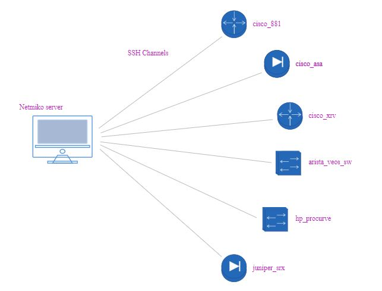

# Automação de redes utilizando python NETMIKO
Neste repositório está hospedado os arquivos utilizados no laboratório.

Esta topologia é um exemplo de como rodar o script em um ambiente de multi-vendor.

